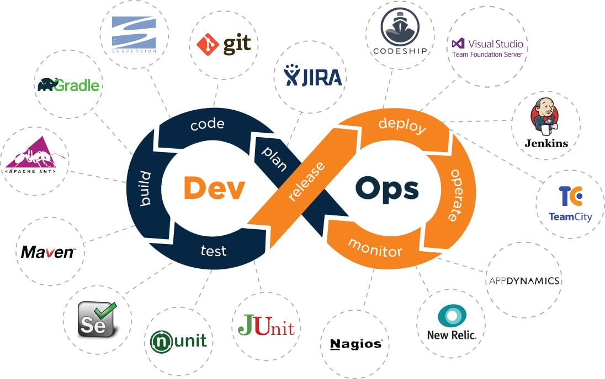

# Getting Started with Go for Backend Systems



Over the last few years, Go has become my default language for building
**distributed backend systems**. Here's why — and a few things I wish I'd known
when I started.

## Why Go

- **Simplicity that scales.** The language is small enough to hold in your head,
  which keeps large codebases readable.
- **First-class concurrency.** Goroutines and channels make concurrent code
  approachable without sacrificing performance.
- **A single static binary.** Deployment is trivial: build once, ship anywhere.

## A minimal HTTP service

```go
package main

import (
	"log"
	"net/http"
)

func main() {
	http.HandleFunc("/healthz", func(w http.ResponseWriter, r *http.Request) {
		w.Write([]byte("ok"))
	})
	log.Fatal(http.ListenAndServe(":8080", nil))
}
```

That's a production-ready health check in a dozen lines.

## What I'd tell a new Go engineer

1. Learn the standard library before reaching for frameworks.
2. Embrace `context.Context` early — it pays off in every real service.
3. Write table-driven tests; they make edge cases obvious.

> Good code is code you can delete without fear. Go's simplicity makes that
> easier than most languages I've used.

More posts coming soon.
